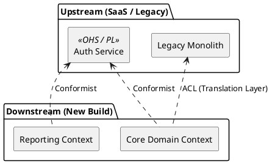

# Context Mapping Patterns

Manage coupling, Conway's Law, and team politics between Bounded Contexts.

### Integration Matrix

| Pattern | Coupling | Description |
| :--- | :--- | :--- |
| **Partnership** | High | Mutually dependent. Succeed/fail together. Synchronized releases. |
| **Shared Kernel** | High | Shared DB schema or library. Keep tiny (e.g., `Money` type). High communication cost. |
| **Customer/Supplier** | Medium | Upstream (Supplier) negotiates roadmap with Downstream (Customer). Often uses **Published Language** as the formal contract/schema negotiated between them. |
| **Conformist** | Medium | Downstream (Consumer) conforms to Upstream. Upstream won't change for you. |
| **ACL (Anti-Corruption)** | Low | Downstream translates Upstream to protect its own model. |
| **OHS / PL** | Low | Upstream provides public API (Open Host Service) and **Published Language** (PL) for many downstream consumers. |
| **Separate Ways** | None | No integration. Duplicate data entry if needed. |

### ⚠️ Shared Kernel (Technical) vs. Shared Domain (Strategic)
It is crucial to distinguish between these two "shared" concepts:
- **Shared Kernel**: A *technical integration pattern*. It represents physical code, a shared database schema, or a shared library tightly coupling two teams. It should be avoided or kept as small as possible.
- **Shared Domain (Shared Core)**: A *strategic business boundary* (see [[Shared-Core-Subdomain]]). It represents a foundational business concept (like "Partner Identity") that anchors semantics for multiple distinct contexts, but is implemented as its own standalone service, not a tightly coupled shared library.

### Visualizing Key Patterns

### Rule of Thumb
- Use **ACL** when integrating with legacy or third-party systems.
- Use **OHS/PL** when you are the Core Domain exposing data to many consumers.
- Avoid **Shared Kernel** unless the teams sit next to each other and pair program frequently.

### Legacy Migration & Strangler Fig
When replacing legacy systems, ACLs act as the physical "Strangler Vines" bridging the old and the new. For details on how to map and manage this transition using Architecture-as-Code, see [[Architecture-As-Code-Transitions]].
