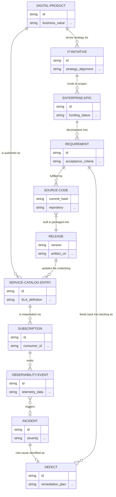

# IT4IT Reference Architecture & DDD Integration

## 1. Executive Summary

The IT4IT standard provides a formal operating model and reference architecture for managing the "business of IT." When synthesized with Domain-Driven Design (DDD), IT4IT ceases to be just an abstract management framework and becomes the **canonical domain model** for our Software Development Life Cycle (SDLC). 

By treating our engineering organization as a system that can be modeled, IT4IT provides the Bounded Contexts (Value Streams), and DDD provides the tactical patterns (Aggregates, Entities, Events) to implement a data-driven, traceable, and product-centric engineering governance model.

## 2. First Principles

Based on our synthesis of IT4IT principles, the following tenets govern our approach to software management:

*   **The Digital Product is the Core Domain:** The "Digital Product" is the central entity that ties together strategy, development, consumption, and operations. All telemetry must relate back to a product.
*   **End-to-End Traceability:** We must maintain an unbroken chain of custody from a strategic initiative down to a deployed line of code and its operational metrics.
*   **Data-Driven IT:** SDLC tools (Jira, GitHub, ServiceNow) are merely user interfaces and execution engines. The underlying truth is a unified Entity-Relationship Diagram (ERD) of our engineering artifacts.
*   **Architecture-as-Code:** The mapping of physical tool data into the logical IT4IT data model must be codified, version-controlled, and automated.

## 3. Value Streams as Bounded Contexts

IT4IT defines four primary value streams. In a DDD context, these act as our primary **Bounded Contexts**, each with its own Ubiquitous Language and Aggregate Roots.

### I. Strategy to Portfolio (S2P)
*   **Focus:** Planning, enterprise architecture, and portfolio management.
*   **Key Aggregates:** `Conceptual Service`, `Enterprise Epic`, `IT Initiative`.
*   **Integration:** Maps high-level business goals to architectural blueprints and funding.

### II. Requirement to Deploy (R2D)
*   **Focus:** The core engineering and delivery loop (Agile, source control, CI/CD).
*   **Key Aggregates:** `Requirement` (Jira Epic/Story), `Source Code` (Git Commit/PR), `Build`, `Release`.
*   **Integration:** The transition from abstract requirements into a logical and physical release package.

### III. Request to Fulfill (R2F)
*   **Focus:** Service catalog, self-service provisioning, and deployment.
*   **Key Aggregates:** `Service Catalog Entry`, `Subscription`, `Fulfillment Request`.
*   **Integration:** How consumers (internal or external) discover and instantiate the digital product.

### IV. Detect to Correct (D2C)
*   **Focus:** Observability, incident management, and continuous feedback.
*   **Key Aggregates:** `Event`, `Incident`, `Problem`, `Defect`.
*   **Integration:** Closing the loop by feeding operational defects back into the S2P or R2D backlogs.

## 4. The IT4IT Data Model (ERD) & Ingestion Strategy

To effectively utilize IT4IT alongside DDD, we must maintain a centralized **Value Stream ERD**. This requires a robust ingestion strategy to normalize telemetry from disparate SDLC tools.

*   **Canonical Mapping:** External entities must be mapped to IT4IT aggregates. For example, a Jira Issue, an Azure DevOps Work Item, and a GitHub Issue all map to the canonical `Requirement` aggregate.
*   **Event-Driven Ingestion:** Ingesting SDLC data should follow event-driven patterns. A webhook from GitHub (e.g., `pull_request.merged`) is translated into a Domain Event (e.g., `SourceCodeMerged`) that updates the IT4IT ERD.
*   **Data Flow Governance:** As explored in our ingestion guides, the ETL pipelines that populate this ERD must be treated as first-class architectural components, documented via Data Flow Diagrams.

## 5. Practical Application & Vault Integration

To utilize IT4IT within our current engineering practices, we will:

1.  **Standardize Terminology:** Adopt IT4IT's ubiquitous language in our [[Engineering Blueprint]] and [[Architecture Decision Records]].
2.  **Enhance the SDLC EKG:** Integrate the IT4IT data model into our [[Enterprise-SDLC-EKG]] to measure the health of our value streams.
3.  **Traceability Checklists:** Update PR and Code Review checklists (in `06-appendices`) to ensure every code change links back to a canonical `Requirement`, which in turn links to a `Digital Product`.
4.  **System Design:** When designing internal developer platforms or CI/CD pipelines, model them against the IT4IT reference architecture to ensure conceptual integrity.

## 6. Canonical Domain Model (ERD)

The goal is to model the "unbroken chain of custody" across the four IT4IT Bounded Contexts (Value Streams) without getting bogged down in the specific JSON payloads of tools like Jira or GitHub.

The following coarse-grained Entity-Relationship Diagram establishes the architectural skeleton—the canonical domain aggregates and their relationships—while leaving the fine-grained implementation details (like exact database columns or tool-specific mappings) to the system implementation level.

### Architectural Characteristics

1. **The Digital Product is the Anchor:** The `DIGITAL-PRODUCT` sits at the top of the hierarchy. Strategy (`IT-INITIATIVE`) drives it, and consumers discover it via the `SERVICE-CATALOG-ENTRY`. Everything else is a byproduct of building or running it.
2. **Tool-Agnostic Aggregates:** The diagram uses canonical DDD aggregates. A `REQUIREMENT` could be a Jira Epic, a GitHub Issue, or an Azure DevOps User Story. `SOURCE-CODE` could represent a Git Commit or a Pull Request. This ensures understanding of *what* belongs here without being forced into a specific vendor's schema.
3. **The Unbroken Chain:** The relationships (the verbs on the lines) explicitly trace the lifecycle from abstract funding (`ENTERPRISE-EPIC`) down to physical code (`SOURCE-CODE`), out to consumer instantiation (`SUBSCRIPTION`), and finally into operational reality (`INCIDENT`).
4. **The Closed Loop:** The bottom relationship (`DEFECT` feeds back into `REQUIREMENT`) visualizes the critical "Detect to Correct" feedback loop mentioned earlier, ensuring operational issues natively become engineering work.

The attributes shown (e.g., `funding_status`, `commit_hash`) act as placeholders. They signal *what type* of data belongs in that entity, setting the expectation that rigorous mapping will be defined in our Data Flow Diagrams or ETL pipelines.
