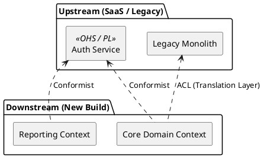

# Context Mapping Patterns

Manage coupling, Conway's Law, and team politics between Bounded Contexts.

### Integration Matrix

| Pattern | Coupling | Description |
| :--- | :--- | :--- |
| **Partnership** | High | Mutually dependent. Succeed/fail together. Synchronized releases. |
| **Shared Kernel** | High | Shared DB schema or library. Keep tiny (e.g., `Money` type). High communication cost. |
| **Customer/Supplier** | Medium | Upstream (Supplier) negotiates roadmap with Downstream (Customer). |
| **Conformist** | Medium | Downstream conforms to Upstream. Upstream won't change for you. |
| **ACL (Anti-Corruption)** | Low | Downstream translates Upstream to protect its own model. |
| **OHS / PL** | Low | Upstream provides public API (Open Host Service) and published language (PL). |
| **Separate Ways** | None | No integration. Duplicate data entry if needed. |

### Visualizing Key Patterns

### Rule of Thumb
- Use **ACL** when integrating with legacy or third-party systems.
- Use **OHS/PL** when you are the Core Domain exposing data to many consumers.
- Avoid **Shared Kernel** unless the teams sit next to each other and pair program frequently.
