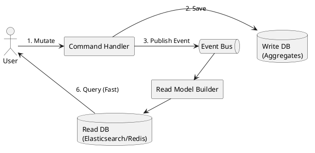

# Cross-Context Integration

Decoupling Bounded Contexts via **Eventual Consistency** and **Async Messaging**.

### 1. Commands vs. Facts
Strictly distinguish between asking for an action (Command) and announcing a truth (Fact).

*   **Commands ("Please do X")**:
    *   **Intent**: Explicit request. Receiver can say "No" (e.g., HTTP 400).
    *   **Coupling**: High. Sender must know the receiver and its API.
*   **Facts / Events ("X happened")**:
    *   **Intent**: Historical truth. Sender doesn't care who listens.
    *   **Coupling**: Low. Pure publish-subscribe.
    *   **⚠️ THE BOUNDARY RULE**: A context can *only* emit facts about itself. It cannot emit events declaring state changes in other contexts.

### 2. The Uptime Dependency Test (Sync vs. Async)
Decide communication style based on whether the caller *must* share an outage with the receiver.

*   **Async Events (Internal Context-to-Context)**: 
    *   **Rule**: Use when contexts shouldn't share an outage (avoiding Temporal Coupling). 
    *   **Why**: Sender finishes instantly; receiver catches up when online. No cascading failures.
*   **Sync APIs (External Client-to-Context)**: 
    *   **Rule**: Use when the caller *must* know if the action succeeded.
    *   **Why**: External clients need direct success/fail feedback (e.g., HTTP 200) to manage their own local state and retries.

### 3. The "Distributed Transaction" Trap
**⚠️ RULE**: NEVER use a Synchronous API if a single user action writes to two different Bounded Contexts simultaneously. A mid-flight network drop creates orphaned state.

#### The Fix: Transactional Outbox Pattern
Guarantees eventual consistency without distributed transactions.

1. **Atomic Local Write**: Save Aggregate state AND Domain Event to a local Outbox table in one DB transaction.
2. **Async Publish**: A background worker polls/streams the Outbox and safely publishes the event to the broker.

```text
[Transaction Boundary]
  1. Save Aggregate state to DB (e.g., Orders Table)
  2. Save Domain Event to DB (e.g., Outbox Table)
[Background Process]
  3. Poll/Stream Outbox Table -> Publish to Kafka/RabbitMQ/EventBridge
  4. Mark Outbox row as processed
```

### 4. Domain Events (Choreography)
- **Flow**: Context A emits `Event` (Operational Event) -> Context B reacts.
- **Pros**: Highly decoupled (Publish-Subscribe).
- **Cons**: Implicit flow, hard to monitor overall process.

### 5. Sagas / Process Managers (Orchestration)
Central coordinator for distributed workflows requiring compensating actions. Often mixes Operational Events (listening to facts) and Operational Requests (issuing commands).

```fsharp
// Saga reacting to events and issuing cross-context commands
let handleSaga event =
    match event with
    | OrderPlaced     -> sendCommand (ReserveStock)
    | StockReserved   -> sendCommand (ProcessPayment)
    | PaymentFailed   -> sendCommand (CancelOrder) // Compensating action
    | PaymentCleared  -> sendCommand (ShipOrder)
```
- **Pros**: Explicit workflow, easy failure handling.
- **Cons**: Centralized coupling point.

### 6. CQRS (Command Query Responsibility Segregation)
Separate Write Side from Read Side to optimize cross-context queries.

