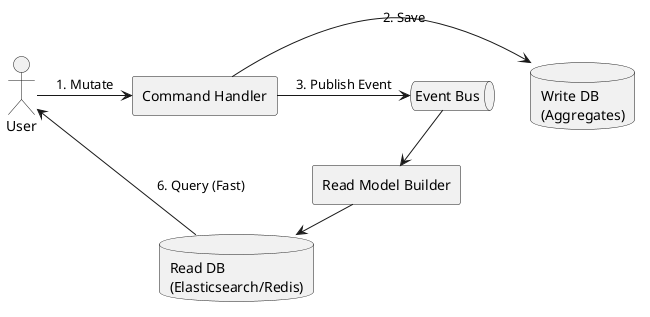

# Cross-Context Integration

Decoupling Bounded Contexts via **Eventual Consistency** and **Async Messaging**.

### 1. Domain Events (Choreography)
- **Flow**: Context A emits `Event` -> Context B reacts.
- **Pros**: Highly decoupled.
- **Cons**: Implicit flow, hard to monitor overall process.

### 2. Transactional Outbox Pattern
Solves the "Dual Write" problem (DB vs Message Broker).

```text
[Transaction Boundary]
  1. Save Aggregate state to DB (e.g., Orders Table)
  2. Save Domain Event to DB (e.g., Outbox Table)
[Background Process]
  3. Poll/Stream Outbox Table -> Publish to Kafka/RabbitMQ/EventBridge
  4. Mark Outbox row as processed
```

### 3. Sagas / Process Managers (Orchestration)
Central coordinator for distributed workflows requiring compensating actions.

```fsharp
// Saga reacting to events and issuing cross-context commands
let handleSaga event =
    match event with
    | OrderPlaced     -> sendCommand (ReserveStock)
    | StockReserved   -> sendCommand (ProcessPayment)
    | PaymentFailed   -> sendCommand (CancelOrder) // Compensating action
    | PaymentCleared  -> sendCommand (ShipOrder)
```
- **Pros**: Explicit workflow, easy failure handling.
- **Cons**: Centralized coupling point.

### 4. CQRS (Command Query Responsibility Segregation)
Separate Write Side from Read Side to optimize cross-context queries.


