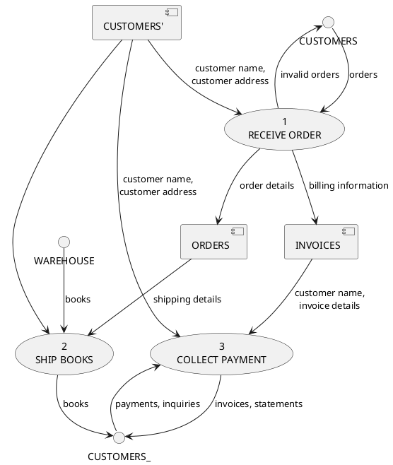

# "A picture of what's going on around here"

# An “artist’s rendering” of the system

- _User requirement_ / _Business Policy_ vs _Implementation Force_

A modeling tool to picture the system as a network of functional processes, connected by "pipelines" and "holding tanks". 

> Think of DFD like a TRAIN MAP:
> The map doesn't indicate exactly when the train arrives or leaves, but it does tell you how to get from point A to B

- system behavior can be described in three ways: functions, dynamics and relationships.

NOTE: DFD useful for function-oriented view (not procedural/sequential!). Data relationships might use ERD instead. Time-dependent → State transitions.

# Redraw

DFD will have to be drawn, redrawn, and redrawn again, often 10 times or more, before:

1. technically correct
2. acceptable to the user
3. neat enough to show to board of directors

# Layout

- DFD levels organize maps in an atlas
- Hierarchical, nested diagrams
- Top-level (Level 0) is "Context Diagram" or "One-Bubble"
    - Context Diagram (show system in context of terminators)
    - Top Level (Process number ≠ order-of-execution)
    - NOTE: Context Diagram might exceed half-dozen rule: reality that is intrinsically complex

- Avoid Clutter:
    - Half-dozen (7±2) process bubbles per page
    - Cleaner architecture, better (readable, maintainable) software!
    - Partition/encapsulate as necessary

- Diverge or converge
    - Diverging flow:
        - duplicate copies of packet are sent to different parts of system
        - complex packet is being split into more elementary packets
        - items with different values are being separated
    - Converging flow:
        - elementary packets are joining together into complex, aggregate packets

- Numbering:
    - Context Diagram: "One Bubble" == The System
    - Figure 0: Shows bubbles 1, 2, 3, 4, ...
    - Figure 3: Shows bubbles 3.1, 3.2, 3.3, ...

# Consistency

- Names should come from a vocabulary meaningful to the user (hear the user saying these words)
    - See "Data Dictionary" [http://yourdon.com/strucanalysis/wiki/index.php?title=Chapter_10]
- choose names (verbs and objects) that would be meaningful to someone in the same industry
    - Building a banking system? process/flows should be understood by someone in a different bank

# Symbols / Notation

Process, flow, store, terminator. 

## CONTROL: Real-time systems

        o  o
     o        o ----|>
    o          o
    o          o
     o        o <|----
        o  o

- Control flows: signals or interrupts
    - binary (on or off)
    - does NOT carry value-bearing data
- Control processes: coordinate / sync activities of other bubbles
    - inputs/outputs are ONLY control flows
    - typically just ONE per DFD
    - modelled as a state-transition diagram

## PROCESS: transform data (or statemachine)

> Bubble, function, or transformation (inputs → outputs)

  ⌢⌢⌢⌢⌢⌢⌢⌢⌢⌢
 ⎛   3.2    ⎞
 ⎜  Detect  ⎟
 ⎝ Carrier  ⎠
  ⌣⌣⌣⌣⌣⌣⌣⌣⌣⌣

- action (verb-object) label
- numbered to indicate hierarchy, not execution order
    - Easy to say "bubble 3" instead of "DETECT CARRIER"
- encapsulate more detail ("process specification")

- state machine modeled by statechart
    - inputs are outputs of other processes
    - outputs are data flows or control flows
    - actions/ guard expressions: `date==birthday, count++`
    - TIP: associate SM actions with exit transitions, not entrance

1. Perform computations
2. Make decisions
3. Split data flows (on content or business rules)
4. Filter/Aggregate data flows

## DATA FLOW: movement of data (or materials, or code)

── samples ─▶
◀─ samples ─▶

- single or double ended
- labelled / named (ON ARROWHEAD OR BOTH ENDS, eg. Question & Answer)
- data-in-motion
- a flow carries only one type of "packet"
    - can consolidate several elementary (see "data dictionary")
    - algebraic data types (ADT): `data Bool = True | False`

NOTE: lambda abstraction

## CONTROL FLOW: binary event (e.g signal / interrupt)

── enable ─▶
◀─ enable ─▶

- single or double ended
- labelled

## DATA STORE: Data at rest (even temporary)

  ╔═══════════╗
  ║ Noun      ║
  ╚═══════════╝

- label indicates contents (system nouns, plural name of packets)
- may represent a static variable, file, database, etc (electronic or other)
- data-at-rest ("non-destructive reads")
- flows in/out of store commonly unlabelled, represent just a single complete packet

## TERMINATOR: an external entity, outside control of the modeled system

  ┌──────────┐
  ┃ A/D      ┃
  └──────────┛

- "outside the domain of change"
- interacts with the modeled system
- sends or receives data from system
- interfaces between our system and the outside world
- TIP: do NOT model any relationship between terminators

---

# Logical vs Physical Model of Process

- Logical: Theoretical process of moving information (where data comes from, goes, changes, ends up)
- Physical: Practical process (specific software, hardware, files, employees)

---

# Avoid Illegal Data flows

- A source/sink cannot provide data to another source/sink without processing
- Data cannot go from source to store without processing
- Data cannot go from store to sink without processing
- Data cannot move from store to store without processing

- Avoid "infinite sinks" (*black hole*): bubbles with inputs but no outputs
- Avoid "spontaneous generator" (*miricale*): bubbles with outputs but no inputs

- Remove processing step that does not actually change data
- Remove conditional logic (always keep within processing step)
- Remove branching (replace with individual flows)

---

# [Ed Yourdon - Structured Analysis Wiki](https://web.archive.org/web/20120203015523/http://yourdon.com/strucanalysis/wiki/index.php?title=Chapter_9)

Typical DFD for a small system:

```

     ┌───────────┐                                           ┌───────────┐
     │ CUSTOMERS │                                           │ WAREHOUSE │
     └────┬────▲─┘                                           └──────────┬┘
          │    │                                                        │
          │    │ invalid         order                     shipping     │
  orders  │    │ orders          details  ┌──┬─────────┐   details      │ books
          │    │         ┌────────────────►  │ ORDERS  ├───────┐        │
          │    │         │                └──┴─────────┘       │        │
          │   ┌┴─────────┴──────┐                            ┌─▼────────▼──┐
          └───►        1.0      │                            │     2.0     │
              │  Receive Order  ◄─────────────┬──────────────►  Ship Books │
              └────────┬────────┘             │              └──────────┬──┘
                       │                      │                         │
           billing     │                      │  customer name,         │ books
           information │                      │  customer address       │
             ┌─┬───────▼──┐           ┌─┬─────┴─────┐                   │
             │ │ INVOICES │           │ │ CUSTOMERS │              ┌────▼───────┐
             └─┴───────┬──┘           └─┴┬──────────┘              │  CUSTOMERS │
                       │                 │                         └▲────────┬──┘
                       │                 │                          │        │
                       │                 │          invoices        │        │
                       │ ┌───────────────▼─┐        statements      │        │
                       │ │    3.0          ├────────────────────────┘        │
                       └─► Collect Payment │                                 │
                         └─────────────────┘◄────────────────────────────────┘
                                                        payments,
                                                        inquiries
```


