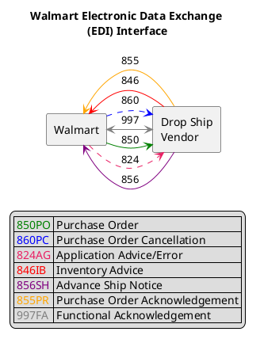

# Keynote: Event-Driven Integration Today and Tomorrow

[Flow Architectures](https://www.oreilly.com/library/view/flow-architectures/9781492075882/)
- 


> __What do I mean by `Flow` in this context?__  
> **Event Driven Integration**  
>       ACROSS  
> **Organization Boundaries**  
>       Through  
> **Standard Interfaces and Protocols**  

Scale - Geoffrey West
[Scale: The Universal Laws of Growth...](https://www.amazon.com/Scale-Universal-Innovation-Sustainability-Organisms/dp/1594205582)

# Prinicpals of "Data Gravity"
> “As Data accumulates (builds mass) there is a greater likelihood that additional Services and Applications will be attracted to this data.”   
> ...the closer you are (i.e. in the same facility) the higher the Throughput and lower the Latency to the Data and the more reliant those Applications and Services will become on Low Latency and High Throughput.
 - [Dave McCrory](https://datagravitas.com/2010/12/07/data-gravity-in-the-clouds/)

# Action Distance: "Information Half-Life"
 
```
        │
    $$$$│ ▲ Business Event
        │
  V  $$$│ +──────────────► ◄► Data Stored (Ready for Analysis)
  A     │     Capture
  L   $$│     Latency     +───────────────► ◄► Analysis Delivered
  U     │                     Analysis
  E    $│                     Latency        +──────────────► ◄► Action Taken
        │                                       Decision
        │                                       Latency
        │
        └──────────────────────────────────────────────────────────────────────
                            TIME
          +Preventative (milliseconds)
                                  +Actionable (seconds)
                                                +Reactive (minutes/hours)
```


Categories of EDA:
- telemetry and analytics
- command and control

- Messaging of Eventing?
    - Messaging: Message Queue (`RabbitMQ`)
    - Eventing: Discrete Events or Event Series?
        - Series: Log-Based Event Processor (`Kafka`)
        - Discrete: Workflow or Single Action?
            - Workflow: Workflow Automation (`Step Functions`)
            - Single: Stateful or Atomic?
                - Atomic: Functions or Event Routing (`Lambda/EventBridge`)
                - Statefull: Stateful Processor (`Flink`)

"Digital Twin"?



[ ] Salesforce Eventbridge SaaS Integration
