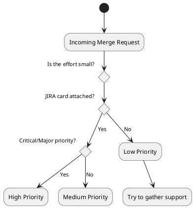

Technical Review Checklist:

Rank these according to criticality (1st - Vital, Last - Inconsequential):
- Small code contributions
- Merged quickly
- JIRA card attached
- In-depth intensity of review
- Automated style checks
- Automated deployment
- Automated tests
- Single Project Maintainer sign-off / approval
- Every thread is resolved
- People liked your work
- Many reviewers

1. Find something to work on
2. Design
3. Work your Magic
4. Merge Request
5. Merge
